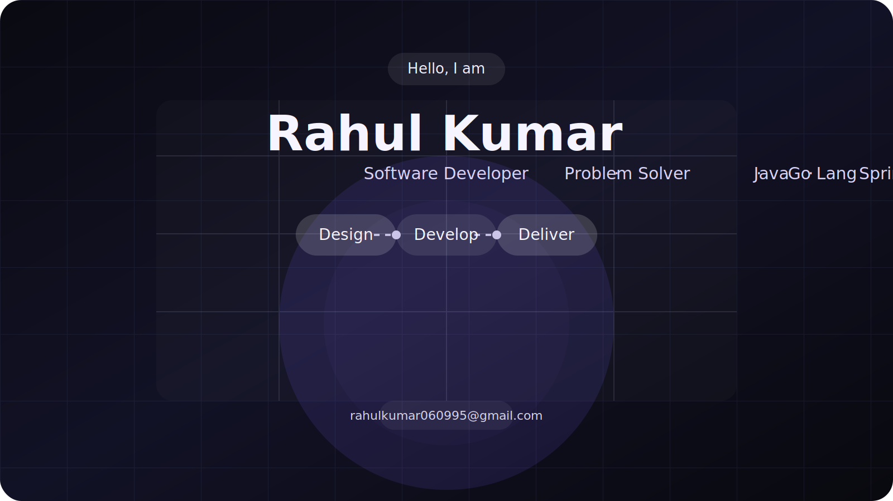

# Hi there! 

### I'm **Rahul Kumar**
#### 🚀 Backend Developer · Devops

 

 

##  About Me

I am a Passionate programmer. Enjoy solving complex coding problems, and learning new programming languages and skills.

- 🎲 Software Developer at JPMorgan Chase & Co. || Ex. Member Of Technical Staff @Oracle || <a href="https://topmate.io/rahul_kumar_295">I am on Topmate</a>.
- 🌱 9 years of experience across Java 8+, Go Lang, Spring, Spring Boot, AWS, and Microservices, with strong exposure to Storage and Cloud Computing (AWS), including Design, Troubleshooting, Implementation, Deployment, and Migrations.
- 👨‍💻 Current Skills: Java 8+, Go Lang, Reactive Java, Spring Boot, DSA, MySQL, Microservices, AWS Serverless Architecture, Jenkins, Docker, Kubernetes, HELM
- 📫 Reach me at this [e-mail](mailto:rahulkumar060995@gmail.com?subject=Hi,%20Rahul)

 

## 🛠️ Skills & Technologies

### ☕ Backend & Core

  
  
  
  
  

### ⚙️ DevOps & Cloud

  
  
  
  
  

### 📨 Messaging & Database

  
  
  

### 🎨 Frontend

  
  

 

## 📊 GitHub Stats

  

 

  

 

## 🌐 Connect with Me

 

  

