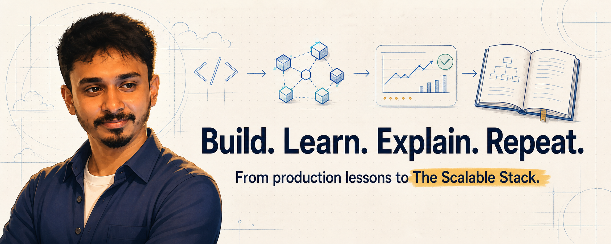

<h1 align="center">
  
</h1>

### 🚀 Senior Backend Engineer (SDE3) · Distributed Systems · Cloud & Platform Engineering

**Software Developer at JPMorgan Chase & Co. · Former Member of Technical Staff at Oracle · 8+ years in backend engineering**

  
  
  
  
  
  
  

## 👋 About Me

I am a **Senior Backend Engineer** with **8+ years of experience** designing, building, and operating scalable backend systems, distributed platforms, and cloud-native infrastructure. I currently work at **JPMorgan Chase & Co.** and previously served as a **Member of Technical Staff at Oracle**.

My core expertise spans **Java, Golang, Spring Boot, microservices, AWS, distributed systems, CI/CD, and platform engineering**. I focus on making complex systems faster, more resilient, easier to operate, and more productive for developers.

- ☕ **Backend:** Java 8–21+, Golang, Spring Boot, Spring MVC, Reactive Java, REST APIs
- 🏗️ **Architecture:** Distributed systems, microservices, system design, fault-tolerant services
- ☁️ **Cloud & Platform:** AWS, serverless architecture, Terraform, Docker, Kubernetes, Helm, ECS Fargate
- ⚙️ **Delivery:** CI/CD, Jenkins, container build systems, developer productivity, cloud migrations
- 📊 **Reliability:** Prometheus, Grafana, Redis Sentinel, rate limiting, circuit breakers, caching
- 🤖 **AI Engineering:** GenAI, Model Context Protocol (MCP), AI-assisted diagnostics and developer tooling

## ✍️ Featured Publication — The Scalable Stack

> **Deep dives into Java, Low-Level Design, System Design, AI, and scalable software engineering for developers.**
>
> I share practical explanations, architecture insights, and lessons from building modern backend and distributed systems.
>
> **[Read The Scalable Stack →](https://thescalablestack.substack.com/)**

## 🏆 Selected Career Highlights

- Helped reduce build and deployment times by **up to 50%** by engineering core components for CI/CD optimization and container-build platforms.
- Provisioned scalable remote-build infrastructure using **Terraform, AWS ECS Fargate, and Kaniko**.
- Architected a fault-tolerant **Java and Spring Boot MCP server foundation**, using worker pools and Redis Sentinel for highly available token caching.
- Strengthened platform resilience with **distributed rate limiting, circuit breakers, caching, and global kill-switch controls**.
- Built AI-assisted tooling to analyze CI/CD failures, identify likely root causes, and generate actionable remediation guidance.
- Led and contributed to enterprise cloud migrations, including the movement of **50 TB of data across 15 brands**.
- Developed observability pipelines for application logs and container metrics using **Prometheus and Grafana**.
- Earned multiple engineering, performance, leadership, and delivery recognitions across JPMorgan Chase & Co., Oracle, and Mindtree.

## 🛠️ Skills & Technologies

### Backend & Architecture

  
  
  
  
  
  
  

### Cloud, Platform & Delivery

  
  
  
  
  
  
  
  

### Data, Observability & AI

  
  
  
  
  
  

## 📈 GitHub Activity

  

## 🐍 Contribution Snake

  

## 🤝 Let's Connect

### Have an interesting engineering problem or opportunity in mind?

I enjoy connecting with people working on **backend architecture, distributed systems, cloud platforms, developer productivity, and practical AI tooling**.

  
  
  

  
  
  
  

<strong>💬 What can we talk about?</strong>

 

- Designing scalable Java, Golang, and Spring Boot services
- Distributed systems, microservices, reliability, and observability
- AWS, Kubernetes, Terraform, CI/CD, and platform engineering
- System Design and Low-Level Design interview preparation
- GenAI, MCP servers, and AI-assisted developer tooling
- Backend engineering careers, mentorship, and knowledge sharing

 

### Building reliable systems · Improving developer platforms · Sharing what I learn

**Thanks for visiting — let's build something scalable. 🚀**

